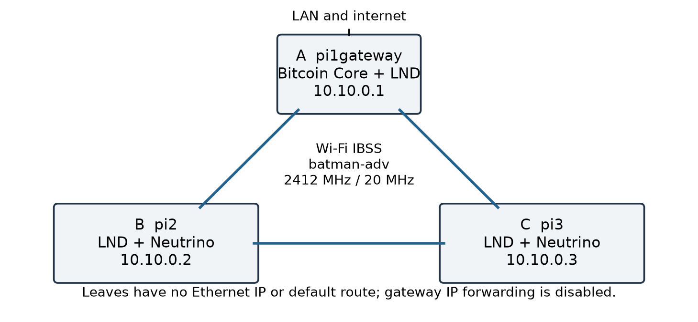
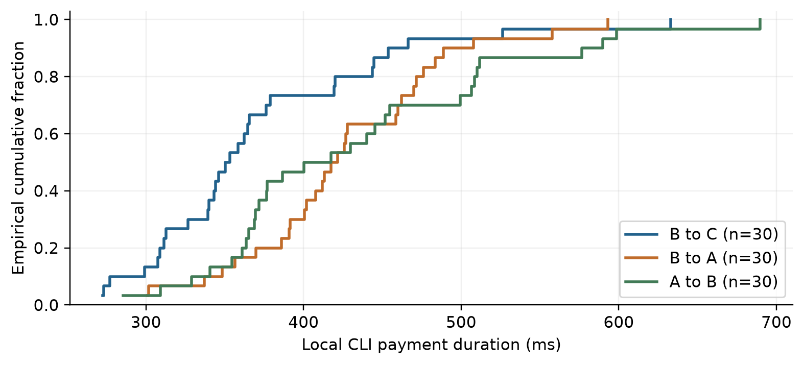
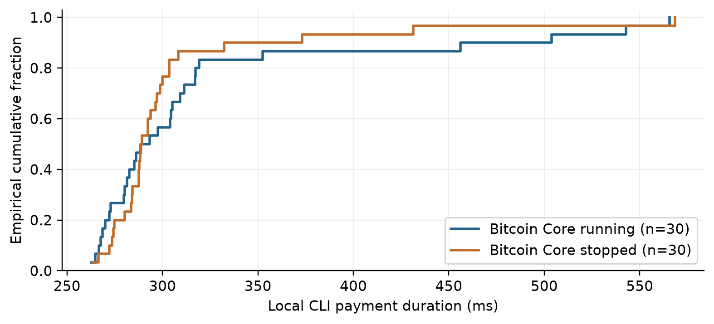

# LNMesh regtest replication on three Raspberry Pi 5 nodes

Experimental writeup for paper development. Deployment and measurements began on 7 September 2026. All amounts below are simulated regtest satoshis. A, B, and C denote pi1gateway, pi2, and pi3 respectively.

The implementation demonstrated funding, channel opening, payment, cooperative closing, force closing, and breach response while the two leaf Pis had no routed internet access. The gateway provided their only Bitcoin peer. All 150 payments in the five planned measurement series succeeded, including 30 while Bitcoin Core was stopped. The stale commitment experiment produced a confirmed breach response, and the primary three-node triangle recovered after individual reboots.

| Demonstration | Observed result |
| --- | --- |
| Inbound funding | B received 400,000 sat of channel balance while its on-chain wallet remained at zero. |
| On-chain funding and opening | B and C each received 2,000,000 sat; B opened a 1,000,000-sat channel to C through A. |
| Payments | 90 of 90 10,000-sat payments succeeded across B-C, B-A, and A-B. |
| Cooperative and force closes | B recovered 400,000 sat cooperatively and 696,263 sat after the force-close sweep. |
| Chain outage | 30 of 30 matched 5,000-sat payments succeeded with Bitcoin Core stopped. |
| Breach response | Revoked state at height 1155; justice at 1156; gap 1 block. |

These results establish feasibility in this particular local regtest configuration. They do not establish wide-area wireless performance, a new Lightning protocol, mainnet safety, censorship resistance, long-duration reliability, or successful multi-hop rerouting. The devices were a few inches apart on one table, according to the operator; exact spacing was not measured.

The supplied archive contains results dated 3 September 2026. Those are historical reference material. All numerical results in this writeup come from the new command journal and outcome records generated during this deployment. No historical log was counted as a fresh trial.

## System design and physical setup

| Attribute | A gateway | B leaf | C leaf |
| --- | --- | --- | --- |
| Hostname | pi1gateway | pi2 | pi3 |
| Pi model revision | Pi 5 Model B Rev 1.1 | Pi 5 Model B Rev 1.0 | Pi 5 Model B Rev 1.0 |
| Reported RAM | 8,454,012,928 bytes | 8,454,012,928 bytes | 8,454,012,928 bytes |
| Bring-up LAN address | 10.17.4.55/23 | 10.17.4.56/23 | 10.17.4.57/23 |
| Mesh address | 10.10.0.1/24 | 10.10.0.2/24 | 10.10.0.3/24 |
| On-chain backend | Local Bitcoin Core RPC | Neutrino to A:18444 | Neutrino to A:18444 |
| Primary Lightning listener | 10.10.0.1:9735 | 10.10.0.2:9735 | 10.10.0.3:9735 |

All three run 64-bit Debian GNU/Linux 13 Trixie with Raspberry Pi kernel 6.18.34+rpt-rpi-2712. The onboard brcmfmac radio is configured for IBSS at 2412 MHz with a 20 MHz channel. batman-adv supplies bat0; the observed routing algorithm is BATMAN_IV. The configured SSID is lnmesh-20260907. US regulatory settings were present during preflight. No external Wi-Fi adapter, container, custom Lightning daemon, or source compilation was required.

Physical placement is operator-reported: a few inches apart on a table. Antenna orientation, exact coordinates, RF noise, interference, power-supply models, SD-card performance, room dimensions, and obstruction geometry were not independently measured. This is a close-range tabletop deployment, not a coverage experiment.

## Software configuration and isolation

| Component | Version or setting |
| --- | --- |
| Bitcoin Core | 29.1.0; installed only on A |
| LND | 0.19.2-beta; commit a839456493037a6af51cbf16db8be6182d614171 |
| Mesh software | batman-adv 2025.4; batctl Debian 2025.0-2 |
| Time service | chrony 4.6.1-3+deb13u2 |
| Measurement tools | iperf3 3.18-2+deb13u2; Python 3.13.5-1 on the Pis |
| Bitcoin indexes | txindex=1; blockfilterindex=1; peerblockfilters=1 |
| Lightning channel policy | Private ANCHORS channels; 1,008-block remote delay; manual opening fee 1 sat/vbyte |
| Wallet initialization | noseedbackup=true, used only for this regtest experiment |
| Administration | PC SSH key as brady; password-authenticated sudo; sudoers unchanged |

Bitcoin and LND ARM64 archives were downloaded over HTTPS from the official release locations and verified against the corresponding SHA-256 manifests before installation [2, 3]. The checks demonstrate consistency with the downloaded manifests. Release signature verification was not performed, so these should not be described as independently authenticated builds.

Gateway RPC and ZMQ listeners are bound to loopback; leaves use only the gateway Bitcoin P2P listener on bat0. LND RPC and REST endpoints are also bound to loopback. Each leaf has neutrino.connect=10.10.0.1:18444. The normal node identities are retained throughout the experiment. Service management uses systemd with restart policies.

Before any funds or channels were created, B and C had zero wallet balances and empty channel lists. Their original Ethernet profiles were disabled and their addresses removed; IPv4 and IPv6 default routes were absent. Probes to the LAN router 10.17.4.1, public IPv4 addresses, a DNS-based HTTPS target, and a literal-IP HTTPS target failed. Mesh ping, SSH via A, and chrony synchronization to A still worked. Both IPv4 and IPv6 forwarding were disabled on A.

Ethernet cables remained physically connected. Isolation here means software-enforced absence of an Ethernet IP address and default route, with forwarding disabled at the gateway. It does not mean an air gap or a physically unplugged cable. The negative probes are observations at the recorded checkpoints, not a packet capture proving every packet over the full run. Administrative SSH commands intentionally traverse the mesh through A.

The IBSS join command requested one fixed BSSID, but iw link reported different BSSID values on the three radios. Their driver-level meaning was not resolved with an over-the-air capture. Connectivity is supported by observed batman-adv neighbors and successful traffic; this report does not claim that a shared effective BSSID was independently verified.

## Measurement protocol and timestamp semantics

The controller records each remote command with its target, transport path, UTC start and end times, elapsed wall time, return code, script, stdout, stderr, and SHA-256 digests. The append-only events.jsonl file indexes these records. outcomes.jsonl records assertions and application data such as channel states, transaction identifiers, block heights, invoice settlement, and wallet balances. Raw JSON responses are retained; aggregate results are regenerated by analyze.py.

| Measurement | Operational definition |
| --- | --- |
| Local CLI payment duration | On-payer monotonic time around runuser and lncli execution, including local startup, RPC, routing, and settlement. Excludes SSH setup, sudo authentication, invoice creation, and recipient verification. |
| LND HTLC duration | Latest resolve_time_ns minus earliest attempt_time_ns in the successful payment record. This is a second, application-reported duration. |
| ICMP RTT | 100 echo requests in each ordered pair, 56-byte payload, 50 ms spacing, bound to bat0. Six series were run sequentially. |
| TCP throughput | iperf3 single-stream TCP, three 10-second trials per B-A, C-A, and B-C direction, with client and server bound to mesh addresses. Receiver throughput is reported in decimal Mbit/s. |
| Statistics | All samples retained. Mean, sample standard deviation, median, minimum, maximum, and a linearly interpolated 95th percentile. No inferential significance test. |

The 10,000-sat payment series consisted of 30 sequential trials for B-C, then 30 B-A, then 30 A-B. After closing and reopening channels, the baseline used 30 B-C payments of 5,000 sat with Bitcoin Core running, followed by 30 of the same amount with it stopped. There was no randomized condition order, independent deployment replication, warm-up exclusion, concurrent throughput workload, or power measurement. These are repeated observations within one deployment, not 30 independent systems.

Pi wall clocks were synchronized by chrony; B and C used A as their sole time source. UTC timestamps identify when observations were made. The controller clock and Pi clocks are separate. Final clock-bracket samples are included in the evidence; cross-host wall-clock differences must not be interpreted as subsecond causal latency. Payment durations use a monotonic clock on one Pi and avoid this problem. System journals retain America/Chicago offsets; the controller and derived tables use explicit UTC offsets.

Block heights, rather than elapsed wall time, determine CSV maturity and the breach confirmation gap. Regtest mining deliberately accelerates block production. A one-block justice gap does not predict mainnet elapsed time, and waiting for a mined batch to become visible is part of this harness, not a consensus latency measurement.

## Measured mesh connectivity and TCP performance

| Direction | Received / sent | RTT median (ms) | RTT mean (ms) | RTT P95 (ms) | RTT max (ms) |
| --- | --- | --- | --- | --- | --- |
| A to B | 100/100 | 7.08 | 6.78 | 9.48 | 19.60 |
| A to C | 100/100 | 6.69 | 5.76 | 7.56 | 8.22 |
| B to A | 100/100 | 7.71 | 7.22 | 10.80 | 16.90 |
| B to C | 100/100 | 6.76 | 6.23 | 9.31 | 9.93 |
| C to A | 100/100 | 6.54 | 5.47 | 7.32 | 8.07 |
| C to B | 100/100 | 7.56 | 6.97 | 10.12 | 11.90 |

| TCP direction | Mean (Mbit/s) | Sample SD | Minimum | Maximum | Retransmits, total |
| --- | --- | --- | --- | --- | --- |
| B to A | 39.36 | 8.24 | 33.33 | 48.75 | 14 |
| C to A | 33.94 | 1.91 | 32.26 | 36.02 | 6 |
| B to C | 25.64 | 4.97 | 20.52 | 30.45 | 21 |

All 600 of 600 ICMP packets were received. Three TCP trials per direction expose substantial within-configuration variation; the data do not support a precise capacity estimate. These transfers were sequential and did not run during the payment timing series. They measure TCP application delivery, including protocol overhead and retransmission effects, rather than the radio PHY rate.

Each Pi reported both other radios as batman-adv neighbors. No link was deliberately blocked to require forwarding through a third radio. Lightning payment routes were also direct. Thus this test validates operation on a mesh-capable network, but it does not measure forced multi-hop radio forwarding or Lightning route failover.

## Funding and channel establishment while leaves were isolated

The experiment began with empty regtest wallets and no channels, after leaf isolation had been verified. A mined 101 blocks to its LND wallet address, producing 10,000,000,000 confirmed sat at that checkpoint. B and C remained at zero. Additional manually mined regtest coinbases later make A's wallet balance large; those are synthetic rewards, not external funds.

| Step | Recorded UTC, 7 Sep | Observed state |
| --- | --- | --- |
| Initial mining | 23:37:43 | Chain height 101; B and C on-chain wallets zero. |
| Inbound channel to B | 23:38:38 | A opened 1,000,000 sat to B and pushed 400,000 sat; B still had zero on-chain sat. |
| On-chain funding | 23:38:46 | B and C each had 2,000,000 confirmed on-chain sat. |
| B opens to C | 23:38:57 | B-funded 1,000,000-sat channel; funding transaction reached A's mempool and confirmed. |
| A opens to C | 23:39:05 | A-funded 1,000,000-sat channel, completing the initial triangle. |

Receiving a pushed channel balance demonstrated receipt of Lightning channel funds without a funded local on-chain wallet. It is distinct from receiving an on-chain transaction. In the next step, the leaves learned their on-chain funding through their sole configured Neutrino peer, A. B then originated the B-C funding transaction while still lacking an internet route. The harness checked that transaction in A's mempool before mining.

| Open operation | Capacity (sat) | First inclusion height | Observed confirmations |
| --- | --- | --- | --- |
| A to B | 1,000,000 | 102 | 6 |
| B to C | 1,000,000 | 114 | 6 |
| A to C | 1,000,000 | 120 | 6 |
| A to B (reopen) | 1,000,000 | 1137 | 6 |
| B to C (reopen) | 1,000,000 | 1143 | 6 |

The harness mined six blocks after each primary channel funding transaction and waited for both endpoints to report an active channel. This describes the observation procedure; it is not a claim that the protocol required six confirmations. The advertised channels were private. Full transaction identifiers and output indexes appear in the transaction appendix and raw records.

## Payment measurements with Bitcoin Core running

| Direction | Success | Median CLI (ms) | Mean CLI (ms) | P95 CLI (ms) | Median HTLC (ms) |
| --- | --- | --- | --- | --- | --- |
| B to C | 30/30 | 351.73 | 370.61 | 499.28 | 277.48 |
| B to A | 30/30 | 419.41 | 425.54 | 535.20 | 344.96 |
| A to B | 30/30 | 408.88 | 432.94 | 594.64 | 337.53 |

| Series | On-Pi start UTC, 7 Sep | On-Pi end UTC, 7 Sep | CLI range (ms) |
| --- | --- | --- | --- |
| B to C | 23:43:43 | 23:45:14 | 272.64 to 632.81 |
| B to A | 23:45:15 | 23:46:30 | 301.22 to 593.12 |
| A to B | 23:46:32 | 23:48:12 | 285.51 to 689.55 |

All 90 sender records reported SUCCEEDED, and recipient invoice lookups confirmed settlement for the expected amount. The measured payments used one Lightning hop, one recorded attempt, and zero routing fee. The local CLI and LND HTLC intervals differ because the CLI interval also includes process startup and surrounding RPC work. Neither is a radio propagation delay measurement.

Direction was not randomized, and the B-C series ran first. The differing sample distributions cannot isolate hardware, routing, thermal, interference, or order effects. Per-trial durations, fees, attempts, hops, payment hashes, and invoice settlement flags are provided in payments.csv. The ECDF retains every successful observation, including the slowest trial.

## Matched payments during a Bitcoin Core outage

| Condition | Success | Median CLI (ms) | Mean CLI (ms) | P95 CLI (ms) | Median HTLC (ms) |
| --- | --- | --- | --- | --- | --- |
| Running | 30/30 | 290.95 | 320.96 | 525.25 | 216.08 |
| Stopped | 30/30 | 289.02 | 305.91 | 405.21 | 212.13 |

Bitcoin Core was stopped on A after the running series. The harness checked its inactive state before payments and again after all 30 stopped-condition payments settled. B and C continued reporting height 1148. No blocks were mined during this interval. The two leaf LND processes and wireless network remained running.

| Condition | On-Pi start UTC, 7 Sep | On-Pi end UTC, 7 Sep |
| --- | --- | --- |
| Running | 23:51:39 | 23:52:56 |
| Stopped | 23:52:59 | 23:54:10 |

The result demonstrates that these already established channels could update and settle payments during this short loss of the Bitcoin backend. It does not demonstrate safe channel opening or closing without chain access, indefinite disconnected operation, or protection from a hostile peer while chain monitoring is unavailable. The one gateway is also a single chain-data source.

The median CLI durations were approximately 291 ms with Core running and 289 ms with it stopped. This small difference is descriptive. The sequential, unrandomized design does not show that stopping Core improves performance. Core was restarted after the series; A's LND was restarted to reconnect, and all three primary channels returned to active state.

## Cooperative closing, force closing, and reopening

| Observation | Cooperative B-A | Force B-C |
| --- | --- | --- |
| Closing node | B | B |
| Close type reported by B | COOPERATIVE_CLOSE | LOCAL_FORCE_CLOSE |
| Commitment / close inclusion height | 126 | 127 |
| CSV maturity height | Not applicable | 1135 |
| Blocks remaining when checked | Not applicable | 1008 |
| B wallet before (sat) | 999,845 | 1,399,845 |
| B wallet after (sat) | 1,399,845 | 2,096,108 |
| B wallet increase (sat) | 400,000 | 696,263 |
| Outcome recorded UTC, 7 Sep | 23:49:43 | 23:50:51 |

B initiated the cooperative closure with A. The close transaction was observed, mined at height 126, and the closed-channel record classified it as COOPERATIVE_CLOSE. B's 400,000-sat channel balance became confirmed on-chain funds. The local close command took approximately 5.71 seconds; its completion does not by itself mean the close was confirmed.

B then force-closed its original channel to C. At height 127, the pending-channel record showed a 1,008-block delay and maturity height 1135. The harness mined the remaining blocks and waited for the nodes to process them, then mined the sweep at height 1136. B reported LOCAL_FORCE_CLOSE with no remaining force-close limbo for this channel. The confirmed wallet increase was 696,263 sat, reflecting the recovered outputs after transaction fees.

Following the 1,008-block batch, A's LND took about 47 seconds from the controller-observed mining return until the first sampled synchronized response. B and C were checked after A, so this run cannot compare their independent catch-up times. That delay is retained in the timeline and is not treated as a payment failure.

The A-B and B-C channels were reopened with new funding transactions. A-C stayed open throughout. The matched baseline therefore used a reopened B-C channel; it was not run on the earlier channel that had been force-closed. Both endpoints were checked for active state before the baseline started.

## Revoked-state breach response

A separate disposable LND process, X, ran on pi3 alongside its main node C. X had its own data directory and identity, P2P port 9736, RPC port 10010, and REST port 8081. B opened a private 500,000-sat channel to X and pushed 200,000 sat. The main C wallet and channel database were not rewound.

With X stopped, the harness copied its channel.db. X restarted and paid B three invoices of 25,000 sat each. Its current local channel balance became 125,000 sat, while the snapshot still assigned it 200,000 sat. Restoring that snapshot was therefore economically favorable to X by 75,000 sat, before any punishment. B was temporarily stopped while X published the old commitment, preventing a channel reestablishment exchange from replacing the intended test condition.

| Evidence | Observed value |
| --- | --- |
| Revoked commitment included | Height 1155 |
| Justice transaction included | Height 1156 |
| Confirmation height gap | 1 block |
| Victim close classification | BREACH_CLOSE |
| Revoked outputs spent by justice | 3, 2 (both principal outputs) |
| Principal inputs to justice | 496,530 sat |
| Justice transaction fee | 12,300 sat |
| Confirmed output / B wallet increase | 484,230 sat |
| X confirmed wallet balance | 0 sat |

After the revoked transaction confirmed, B restarted, detected the breach, and broadcast the justice transaction. The transaction spends both non-anchor principal outputs of the revoked commitment, including the output that the stale state assigned to X. Its 484,230-sat output equals the observed increase in B's confirmed wallet. B classified the channel as BREACH_CLOSE. The two 330-sat anchors are excluded from the principal-output claim.

The funding transaction, revoked transaction, justice transaction, confirmation block hashes, full witness data, and wallet snapshots are retained. No claim is made about a third-party watchtower: B itself resumed monitoring and responded. X is stopped and not enabled at boot; its stale files are retained separately. The main three-node triangle was checked again after the test.

A setup defect initially made X advertise port 9735 despite listening on 9736, causing a reconnection delay after its snapshot restart. The advertised port was corrected, and an explicit outbound connection was made before advancing state. This interruption is in the raw journal. The test used manually scheduled regtest blocks and a cooperative gateway miner; it does not measure detection under censorship or congested production fee conditions [4, 5].

## Reboot persistence and the final operational state

The initial reboot of B exposed a deployment defect: bat0 received a different virtual MAC after reboot, while A retained an IP neighbor entry for the old address. The radio remained visible to batman-adv but IP traffic failed. Deleting A's stale neighbor entry restored B. C was also rebooted during that initial diagnostic sequence; its stale neighbor mapping was explicitly corrected. These assisted recoveries are not counted as automatic successes.

The fix persists each current bat0 MAC in /etc/lnmesh/mesh.env and applies it before bringing bat0 up. Fresh deployment scripts now preserve an existing MAC or derive a stable locally administered MAC from the Wi-Fi interface. No extra network daemon was introduced. All three nodes were then rebooted individually with their persisted MACs, and identities, channel activity, leaf isolation, and application access were checked.

| Node | Scheduled UTC, 8 Sep | Fully checked UTC | Observed recovery (s) | Persistent bat0 MAC |
| --- | --- | --- | --- | --- |
| B | 00:06:32 | 00:07:51 | 79.22 | 82:d6:e3:11:03:bf |
| C | 00:07:52 | 00:09:23 | 90.11 | a2:8a:1f:07:7e:04 |
| A | 00:10:52 | 00:12:10 | 77.61 | 42:dd:83:e7:7e:8b |

Recovery time starts before the command that schedules a reboot three seconds later and ends after service, chain, channel, route, and MAC checks. It includes polling intervals, SSH setup, and channel reconnection; it is not OS boot time. Connection resets, temporary name-resolution failure, timeouts, and route unavailability during reboot are retained in the command journal.

The first gateway retry reached its local services before the mesh management paths were usable; the harness stopped on an immediate leaf RPC error. A bounded path-readiness wait was added, and the gateway reboot was repeated successfully without another network configuration change. The table contains the completed checks after the MAC fix, including that repeated gateway trial.

| Final node | Height | Active channels | Pending / inactive | Confirmed wallet (sat) |
| --- | --- | --- | --- | --- |
| A | 1156 | 2 | 0 / 0 | 1,483,587,352,934 |
| B | 1156 | 2 | 0 / 0 | 1,079,969 |
| C | 1156 | 2 | 0 / 0 | 2,299,876 |

The three primary nodes retain their original public keys and form three unique active channels, reported at both endpoints. A final 1,000-sat B-C payment settled after the reboot checks. This functional payment is additional to the 150 planned measurement payments and the three state-advancing breach payments; it is not pooled into their distributions. X remains stopped. The leaves remain accessible through A over the mesh, with no Ethernet address or default route.

## Final host and clock metadata

| Node | Controller UTC, 8 Sep | LND RSS (MiB) | LND CPU (%) | Temp. (C) | LND data bytes |
| --- | --- | --- | --- | --- | --- |
| A | 00:13:41 | 116.94 | 2.8 | 46.6 | 7,584,406 |
| B | 00:13:43 | 90.88 | 0.9 | 47.2 | 11,639,246 |
| C | 00:13:45 | 86.34 | 1.1 | 47.7 | 7,226,404 |

RSS is the resident memory reported by ps, converted from KiB to MiB. CPU percentage is ps's process-lifetime average since the most recent restart, not an instantaneous sample or a benchmark averaged across the payment phase. These records were collected after reboot, during low application load and concurrent read-only transaction validation. They should not be used to infer peak resource demand or energy efficiency.

At the gateway endpoint snapshot, Bitcoin Core RSS was 54.80 MiB and its data directory occupied 20,118,730 bytes. All Pis reported throttled=0x0 at this post-reboot checkpoint. That value does not prove an absence of throttling during the earlier pre-reboot measurements. Free filesystem space exceeded 108 billion bytes on each device.

| Node | Chrony stratum | Chrony system-time estimate |
| --- | --- | --- |
| A | 3 | 0.000338725 seconds slow of NTP time |
| B | 4 | 0.000137508 seconds slow of NTP time |
| C | 4 | 0.000541568 seconds slow of NTP time |

Chrony reported Normal leap status on all three. A used an external NTP source; B and C selected 10.10.0.1. These are chrony's own estimates and do not constitute an independent timing calibration.

| Pi | Samples | Pi minus PC lower bound (s) | Pi minus PC upper bound (s) |
| --- | --- | --- | --- |
| A | 3 | -1.047524 | -0.870424 |
| B | 3 | -1.048995 | -0.709172 |
| C | 3 | -1.045357 | -0.705514 |

Each bracket surrounds one remote time.time_ns() response with controller UTC start/end times. The table intersects the three brackets per Pi, assuming its clock offset was stable over those seconds. It bounds the offset without assuming symmetric SSH delay. The Pis were roughly one second behind the PC clock. No wall-clock timestamps in the raw files were retroactively shifted; monotonic local payment durations remain the timing basis.

The controller ran Windows 11 build 26200, PowerShell 7.6.5, and Python 3.12.14; the Pis used Debian Python package 3.13.5-1. Full kernel strings, boot identifiers, process lifetimes, interface counters, MAC addresses, service states, regulatory output, package versions, sanitized configurations, binary hashes, and apt change history are in the final-host-metadata records.

## Evidence quality, provenance, and known irregularities

The final analyzed journal contains 1056 completed remote command records and 0 unmatched start records. It is an execution journal, not an externally witnessed or cryptographically signed laboratory record. SHA-256 checks provide file integrity and traceability, not proof that a remote machine reported truthfully. The raw evidence, derived tables, and this report are packaged with a file manifest.

Four early stdout records fail their originally recorded hashes because the first filename scheme combined a decimal timestamp with Path.with_suffix(), causing concurrent records to share output paths. Their complete original per-host stdout cannot be recovered from those files. This was corrected before channel and payment testing; the affected preflight was repeated under unique names. Final package inventory and apt history establish installed versions, but do not reconstruct every lost installer line.

| Affected host | Stage | Original event identifier |
| --- | --- | --- |
| C | privileged-preflight | 20260907T232911.718985Z-c-ddf514 |
| B | privileged-preflight | 20260907T232911.718985Z-b-59ecef |
| A | install-base-packages | 20260907T233012.549045Z-a-b95528 |
| C | install-base-packages | 20260907T233012.550021Z-c-2ef2cb |

Early Windows writes also converted LF to CRLF after hashing text. The audit accepts an exact byte hash or, for those older files, a single CRLF-to-LF normalization matching the recorded hash. Later writes explicitly preserve LF. After that normalization, the four stdout collisions above are the remaining mismatches. Current manifest hashes describe the actual files being delivered; they do not repair the older mismatches.

Three early mesh validators returned nonzero after successful ping checks because sudo did not preserve SSH_CONNECTION and the script used set -u. The diagnostic expression was corrected and the full check rerun successfully. Two later connect commands returned already connected; the associated channel opens still completed. The disposable-node port defect and reboot recovery findings are described in their respective sections. Nonzero exits are retained, including expected reboot outages; there was no deletion of unsuccessful trials to improve the payment statistics.

The source archive is LNMesh-2026-09-05.tar.gz, 152,771 bytes. Its SHA-256 is `2609eff4c7b12d9cc5d70a981f4629350d37c567058320668d7002d65eb4c616`. It is supplied by the operator, rather than downloaded as an independently verified research dataset. The historical archive is kept separately from the fresh evidence bundle.

Passwords and live RPC credentials are not included in the delivered evidence. SSH private keys, wallet databases, seeds, and macaroon files were not copied into the bundle. Public node keys, local addresses, synthetic regtest transaction witnesses, and some synthetic payment data are retained for reproducibility. The measurement scripts and report were produced with AI-assisted execution and analysis and should be independently reviewed before publication.

## Timeline of the fresh run

| Controller UTC | Checkpoint | Outcome record name |
| --- | --- | --- |
| 2026-09-07 23:37:43 | 101 blocks mined | gateway-initial-mining |
| 2026-09-07 23:38:38 | B has inbound balance, on-chain zero | inbound-balance-with-zero-onchain |
| 2026-09-07 23:38:46 | B and C funded on-chain | offline-onchain-funding |
| 2026-09-07 23:48:26 | 90-payment series and snapshot complete | after-payment-series |
| 2026-09-07 23:49:43 | Cooperative close recovery confirmed | cooperative-close |
| 2026-09-07 23:50:51 | Force-close sweep recovery confirmed | force-close |
| 2026-09-07 23:51:25 | Primary triangle reopened | after-close-reopen |
| 2026-09-07 23:54:16 | 30 stopped-backend payments verified | chain-stopped-baseline |
| 2026-09-07 23:54:36 | Backend and triangle recovered | after-baseline-recovery |
| 2026-09-07 23:57:30 | Revoked state advantage established | breach-state-before-rewind |
| 2026-09-07 23:57:42 | Revoked commitment confirmed | revoked-commitment-confirmed |
| 2026-09-07 23:58:00 | Breach response and wallet checks complete | breach-response |
| 2026-09-07 23:58:11 | Main triangle checked after breach | after-breach-main-triangle |
| 2026-09-08 00:05:28 | Initial assisted reboot findings recorded | reboot-initial-run-correction |
| 2026-09-08 00:12:28 | Final post-reboot triangle snapshot | final-active-triangle |

The experimental session crosses midnight UTC: functional experiments occurred on 7 September and final persistence checks on 8 September. Both fall on 7 September in America/Chicago (UTC-05:00). Checkpoint timestamps are observation times after their assertions, not necessarily transaction broadcast or first-detection times. Full precision and command start/end intervals are in timeline.csv and events.jsonl; payment on-Pi timestamps are separately labeled in payments.csv.

The first structured privileged preflight starts near 23:29 UTC. Preliminary host discovery and authentication attempts preceded this journal; they are not reconstructed as fabricated command records. The user supplied the brady username and authorized password-authenticated sudo. Root command execution, file creation and fsync, kernel-module loading, and temporary-interface creation/removal were verified before installation and isolation.

## Transaction and identity appendix

| Artifact | Full transaction ID; :index where applicable |
| --- | --- |
| On-chain funding to B | `fbb2dae271d7950314e139f93584c6af978a2023263e638b6c9f51913ad50a6d` |
| On-chain funding to C | `2a67f7c5c2567800ba48760ae4a3028710429a6959f210ec25fa0bac014605a1` |
| A-B initial channel | `6e1b28f974579138d8cc31ad1ad9f21eaf627a2c6f37e42851e3d946b07a1b72:0` |
| B-C initial channel | `6d4a0f8487a7ccd0e67c4ef24bf96fd1b5a4a655be58962a56026862fe4d507b:1` |
| A-C initial channel | `198b923d80e741f24d66661aadbdaa0dab094a2ec20e6711f94c0114cfd48ed5:0` |
| A-B reopened channel | `cea4c5a396aa6a8922072ac154dd45e924cfc75ec01132b3f835dc790df8eda8:0` |
| B-C reopened channel | `428776bc41d7dc6c350c2a890aa19bf7b8b655f5c31be65e40d7833217a0568f:1` |
| B-A cooperative close | `d166db642dac138b247cc6d9faabe632fcfedf60088203ff913ce47a24b3a6fc` |
| B-C force-close commitment | `6e01af20d747b63a0846646738a9810cda42f6ee2d1fe468762c869cacfa662f` |
| Force-close sweep 1 | `e5f452b008ac89e6d1be6228969a9921700b5a1cdf4ac9471fd1edf337051c07` |
| B-X breach-test channel | `6908228319e87e2d1d1d3b405fc6b750e48db087658102b45b43469f7e055ccc:1` |
| Revoked commitment | `e81de91942ca60c7d76919e4634a9f28f5e7cad70e838741e03800bbd8c6818e` |
| Justice transaction | `0342fed1606f900a8675b9f00430cf0c188b75ed628e9b0c65a20c519359f565` |

Transaction IDs refer exclusively to the local regtest chain. A public Bitcoin explorer cannot resolve them. Channel points include the funding output index. Verbose Bitcoin RPC responses in the evidence include scripts and witness stacks; the breach proof also retains the two confirmation block hashes.

| Node | Public Lightning identity |
| --- | --- |
| A | `0230b0c300e03818338183dea06ab1ce43f7533dc5e524df2c2052cfc66a97916d` |
| B | `0203692afabd31195b4c27e28c4f8ee76bfb651c84c17b1acab85b1a6219bde1ae` |
| C | `030b7a54e192c3c99b05b97e3a90e3598e44173726b0f0a889e07c3bc82495f2c1` |

The final unique channel points are the reopened A-B and B-C channels and the initial A-C channel. Transaction and identity values are copied from structured outcomes, not manually transcribed from screenshots.

## Limits of interpretation and next experiments

The supported claim is that stock LND and Bitcoin Core completed the planned channel lifecycle demonstrations in one three-Pi regtest deployment, with two leaves using software-isolated Wi-Fi mesh connectivity and a single gateway chain peer. The experiments add reproducible observations, accounting, and a deployment repair. They do not establish novelty relative to the full literature.

The original LNMesh paper by Kurt, Sahin, Harrilal-Parchment, and Akkaya describes offline Lightning payments over community wireless networks and studies channel-assignment strategies [1]. This writeup is an implementation and experimental record inspired by the supplied archive. It does not reproduce that paper's mobility simulations, large-scale topology results, or Bluetooth experiments. Claims in the archive about other backend failures are historical and were not counted as newly tested here.

External validity is limited by one close-range tabletop placement, three similar devices, one radio channel, a small number of sequential trials, and one OS/software configuration. The experiment did not measure power use, mobility, range, wall attenuation, radio congestion, simultaneous payments, long-duration uptime, throughput under payment load, packet-level isolation throughout the run, or gateway redundancy. Reported process memory and temperatures are endpoint snapshots, not resource benchmarks.

Security interpretation is limited by regtest and the gateway model. A controls mining and supplies the leaves' only Bitcoin peer. A dishonest or unavailable gateway can withhold fresh chain data or fail to relay transactions. Light-client validation does not guarantee timely visibility through a single withholding peer. The observed breach protection required B to resume monitoring and a miner to include justice in time; neither censorship nor deliberate chain-data withholding was tested. The 1,008-block delay is a chosen test parameter, not a proved safe deployment policy.

For a paper, prioritize independent deployment repetitions and randomized condition order; measure exact spacing and RF conditions; force a documented two-hop radio path; test controlled packet loss and gateway outages; measure memory, CPU, and power under load; and repeat breach response with varied offline intervals and fee conditions. Preserve all failed attempts and preregister which endpoints constitute success. Field or production-network experiments would require a separately designed study.

## Reproduction and operations

README.md and run.ps1 document the fresh-node sequence and mesh SSH commands. The scripts install pinned ARM64 binaries and systemd services without source compilation, containers, or changes to sudoers. Review state before resuming a failed phase: mining, opening channels, and stale-state restoration are stateful actions, not harmless reset commands. The supplied launcher was syntax-checked and its constituent operations were executed during this run; the final combined launcher was not replayed end to end on newly erased Pis.

Use `experiment/run.ps1 -Phase status` from PowerShell for read-only status. Inside a Pi SSH session, `sudo lncli-mesh getinfo` inspects its node. On A, `sudo bcli getblockchaininfo` inspects regtest. The leaf recovery command `sudo /usr/local/sbin/lnmesh-restore-lan` re-enables the original Ethernet profile; doing so changes the offline condition. No continuous miner is installed.

## References and delivered data

[1] [Ahmet Kurt, Abdulhadi Sahin, Ricardo Harrilal-Parchment, and Kemal Akkaya. LNMesh: Who Said You need Internet to send Bitcoin? Offline Lightning Network Payments using Community Wireless Mesh Networks. arXiv:2304.14559v1, 2023; accepted to IEEE WoWMoM 2023.](https://arxiv.org/abs/2304.14559v1)

[2] [Bitcoin Core 29.1 official release artifacts and checksum manifest.](https://bitcoincore.org/bin/bitcoin-core-29.1/)

[3] [Lightning Network Daemon v0.19.2-beta release.](https://github.com/lightningnetwork/lnd/releases/tag/v0.19.2-beta)

[4] [Lightning BOLT #3: Bitcoin Transaction and Script Formats. Protocol reference; the linked master document can change.](https://github.com/lightning/bolts/blob/master/03-transactions.md)

[5] [LND v0.19.2-beta safety documentation.](https://github.com/lightningnetwork/lnd/blob/v0.19.2-beta/docs/safety.md)

[6] [LND v0.19.2-beta sample configuration, including Neutrino peer configuration and regtest-only noseedbackup setting.](https://github.com/lightningnetwork/lnd/blob/v0.19.2-beta/sample-lnd.conf)

Primary references were consulted on 7-8 September 2026 UTC. They explain the existing implementations and protocol context. All performance, timing, wallet, transaction, and reboot results in this document come from the accompanying experiment records, not those references.

| Delivered file or directory | Purpose |
| --- | --- |
| LNMesh-research-writeup.pdf | Typeset report for review and sharing. |
| LNMesh-research-writeup.md / .html | Editable and browser-readable forms of the same content. |
| payments.csv | 151 ordinary payment rows: 150 planned measurements plus one final functional check. The three breach-state payments remain in outcomes.jsonl. |
| throughput.csv / ping_summary.csv | Nine TCP trials and six 100-packet ICMP series. |
| timeline.csv / analysis.json | Command index and regenerable aggregate data. |
| figures/*.png and *.svg | Raster and editable vector exports of the four figures. |
| evidence/ | Timestamped command scripts, stdout/stderr, structured outcomes, metadata, and provenance. |
| SHA256SUMS.txt | Hashes of the delivered source, evidence, and report files. |
